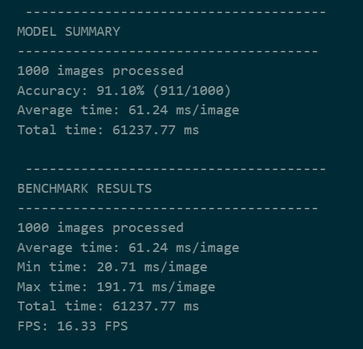
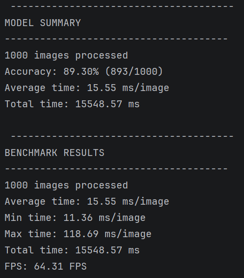

This project implements an end-to-end traffic sign recognition system inspired by real-world automotive AI pipelines used in ADAS (Advanced Driver Assistance Systems).

The workflow mirrors how ML models are developed and deployed in the automotive industry:

- **Python** is used for data preparation and model training - the fast, iterative part
- **C++** handles everything from image loading to inference and evaluation - the production-grade, performance-critical part

The model is trained on the **GTSRB dataset** (German Traffic Sign Recognition Benchmark), which contains over 50,000 images across 43 traffic sign classes. After training, the model is exported to the **ONNX** (Open Neural Network Exchange) format.

---

#### Results in Python

#### Results in C++

---

## Python vs C++ Inference Comparison

| Metric     | Python      | C++         | Speedup   |
| ---------- | ----------- | ----------- | --------- |
| Accuracy   | 91.10%      | 89.30%      | —         |
| Correct    | 911/1000    | 893/1000    | —         |
| Avg time   | 61.24 ms    | 15.55 ms    | **3.94x** |
| Min time   | 20.71 ms    | 11.36 ms    | 1.82x     |
| Max time   | 191.71 ms   | 118.69 ms   | 1.62x     |
| Total time | 61237.77 ms | 15548.57 ms | **3.94x** |
| FPS        | 16.33       | 64.31       | **3.94x** |

C++ is **3.94x faster** than Python on the same 1000-image test set.  
Accuracy difference: **1.80%** (Python higher — due to differences in image loading and bilinear interpolation between PIL and the custom C++ preprocessor).
