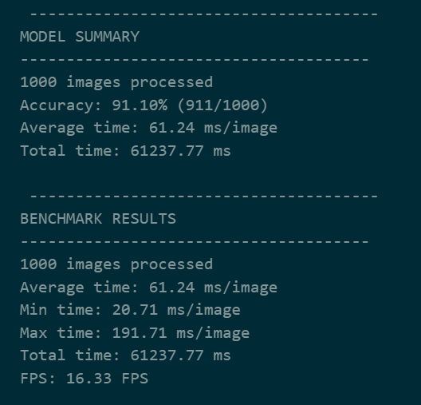
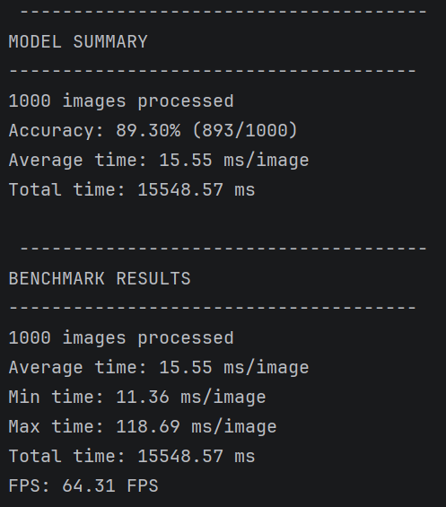

# Traffic Sign Recognition Pipeline

This project implements an end-to-end traffic sign recognition system inspired by real-world automotive AI pipelines used in ADAS (Advanced Driver Assistance Systems).

The workflow mirrors how ML models are developed and deployed in the automotive industry:

- **Python** is used for data preparation and model training
- **C++** handles everything from image loading to inference and evaluation - the performance-critical part

The model is trained on the **GTSRB dataset** (German Traffic Sign Recognition Benchmark), which contains over 50,000 images across 43 traffic sign classes. After training, the model is exported to the **ONNX** (Open Neural Network Exchange) format.

---

#### Results in Python

<!--  -->

```
--------------------------------------
MODEL SUMMARY
--------------------------------------
1 image processed
Accuracy: 100.00% (1/1)
Average time: 200.69 ms/image
Total time: 200.69 ms

--------------------------------------
BENCHMARK RESULTS
--------------------------------------
1 image processed
Average time: 200.69 ms/image
Min time: 200.69 ms/image
Max time: 200.69 ms/image
Total time: 200.69 ms
FPS: 4.98 FPS
```

```
--------------------------------------
MODEL SUMMARY
--------------------------------------
1000 images processed
Accuracy: 91.10% (911/1000)
Average time: 61.24 ms/image
Total time: 61237.77 ms
--------------------------------------
BENCHMARK RESULTS
--------------------------------------
1000 images processed
Average time: 61.24 ms/image
Min time: 20.71 ms/image
Max time: 191.71 ms/image
Total time: 61237.77 ms
FPS: 16.33 FPS
```

#### Results in C++

<!--  -->

```
--------------------------------------
MODEL SUMMARY
--------------------------------------
1 images processed
Accuracy: 100.00% (1/1)
Average time: 60.64 ms/image
Total time: 60.64 ms

--------------------------------------
BENCHMARK RESULTS
--------------------------------------
1 images processed
Average time: 60.64 ms/image
Min time: 60.64 ms/image
Max time: 60.64 ms/image
Total time: 60.64 ms
FPS: 16.49 FPS
```

```
--------------------------------------
MODEL SUMMARY
--------------------------------------
1000 images processed
Accuracy: 89.30% (893/1000)
Average time: 15.55 ms/image
Total time: 15548.57 ms
--------------------------------------
BENCHMARK RESULTS
--------------------------------------
1000 images processed
Average time: 15.55 ms/image
Min time: 11.36 ms/image
Max time: 118.69 ms/image
Total time: 15548.57 ms
FPS: 64.31 FPS
```

---

## Python vs C++ inference comparison for 1000-image test set

| Metric     | Python      | C++         | Speedup   |
| ---------- | ----------- | ----------- | --------- |
| Accuracy   | 91.10%      | 89.30%      | —         |
| Correct    | 911/1000    | 893/1000    | —         |
| Avg time   | 61.24 ms    | 15.55 ms    | **3.94x** |
| Min time   | 20.71 ms    | 11.36 ms    | 1.82x     |
| Max time   | 191.71 ms   | 118.69 ms   | 1.62x     |
| Total time | 61237.77 ms | 15548.57 ms | **3.94x** |
| FPS        | 16.33       | 64.31       | **3.94x** |

C++ is **3.94x faster** than Python on the same 1000-image test set.  
Accuracy difference: **1.80%** (Python higher - because of the differences in image loading and interpolation used in PyTorch functions vs the ones implemented in C++).

## Python vs C++ inference comparison

| Images Count | Platform        |     Accuracy (%)     |     Total Time (ms)      | Avg Time / Image (ms) |       FPS        |  Speedup (FPS)   |
| :----------- | :-------------- | :------------------: | :----------------------: | :-------------------: | :--------------: | :--------------: |
| **1**        | Python <br> C++ | 100.00% <br> 100.00% |    200.69 <br> 60.64     |   200.69 <br> 60.64   | 4.98 <br> 16.49  | — <br> **3.31x** |
| **100**      | Python <br> C++ |  91.00% <br> 90.00%  |   2233.96 <br> 1855.96   |   22.34 <br> 18.56    | 44.76 <br> 53.88 | — <br> **1.20x** |
| **1000**     | Python <br> C++ |  91.10% <br> 89.30%  |  61237.77 <br> 15548.57  |   61.24 <br> 15.55    | 16.33 <br> 64.31 | — <br> **3.94x** |
| **10000**    | Python <br> C++ |  91.30% <br> 90.72%  | 369864.53 <br> 203271.65 |   36.99 <br> 20.33    | 27.04 <br> 49.20 | — <br> **1.82x** |
